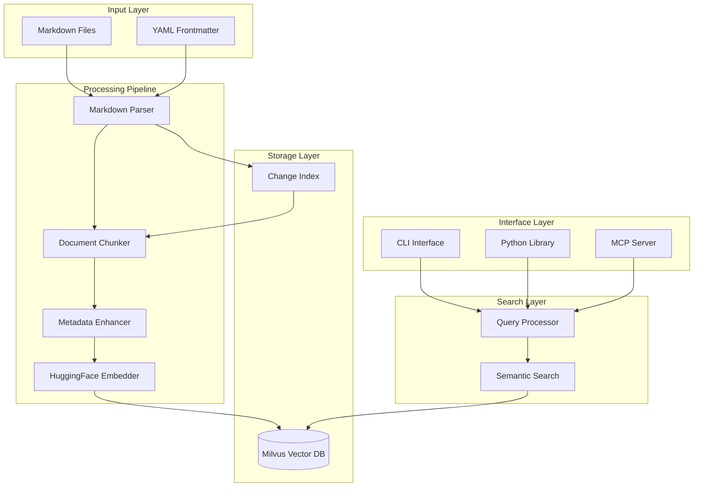
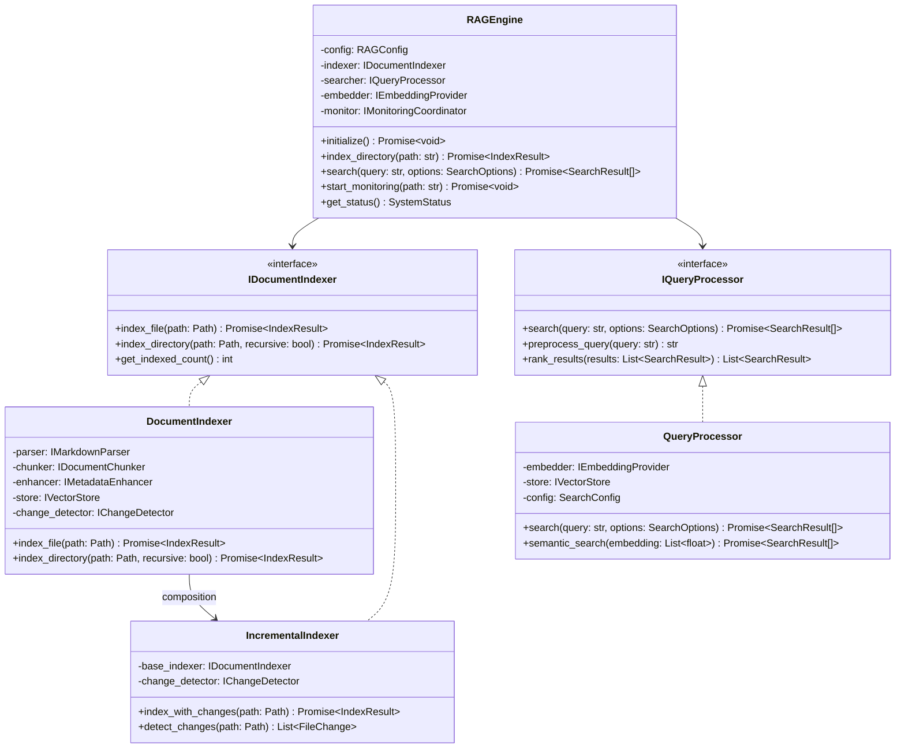
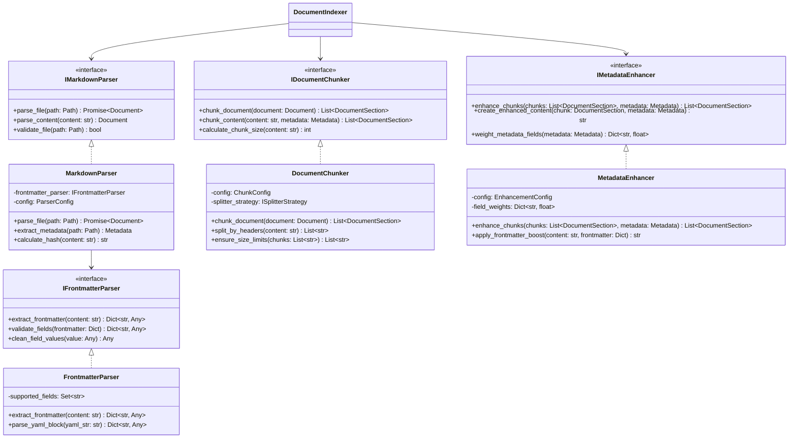
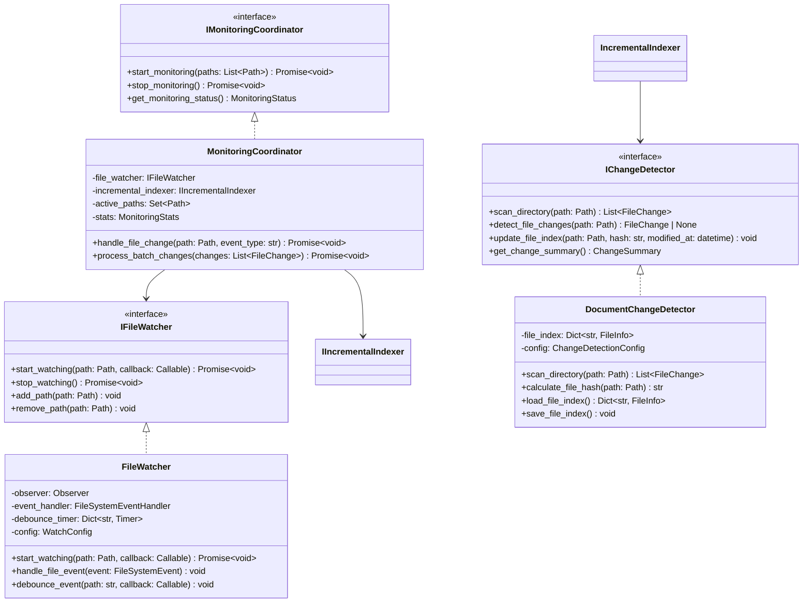
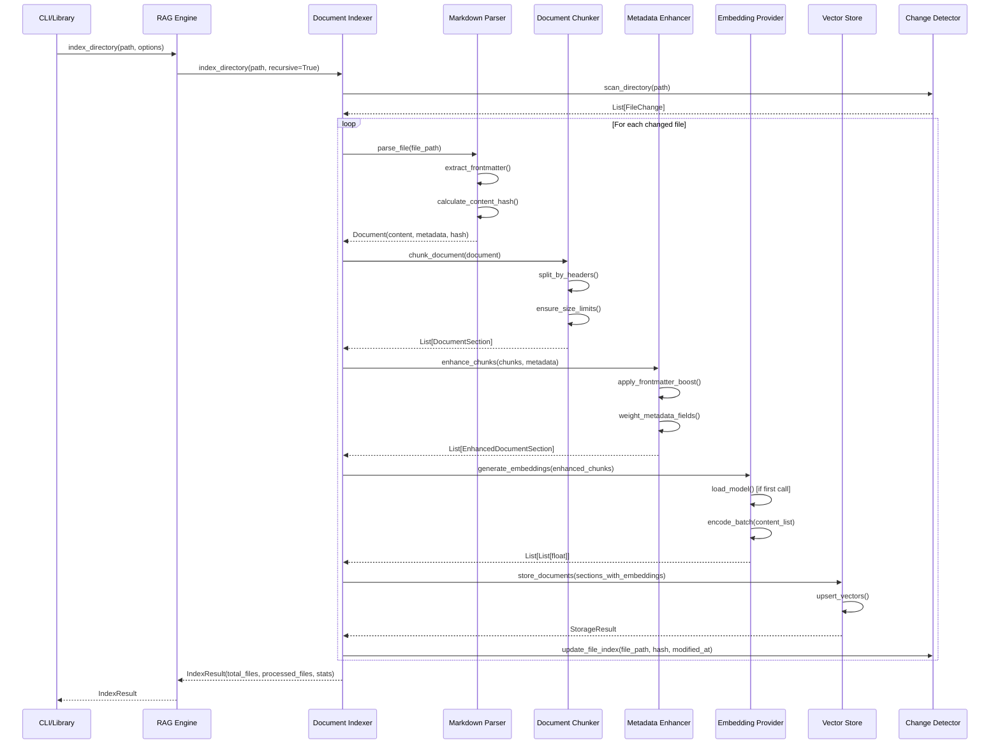
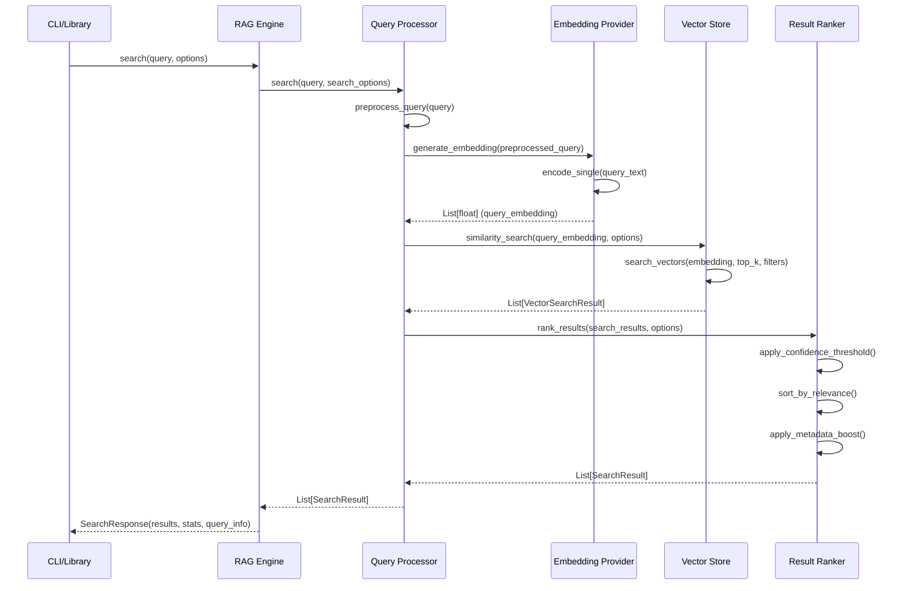
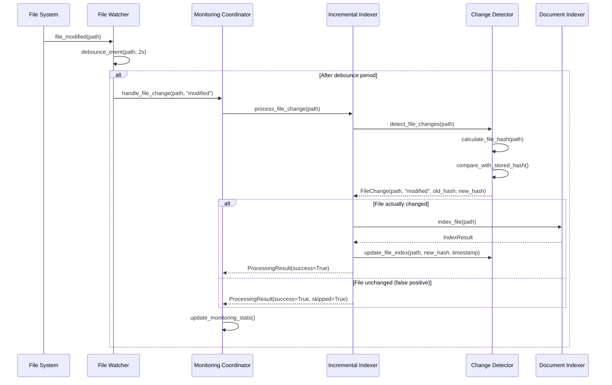
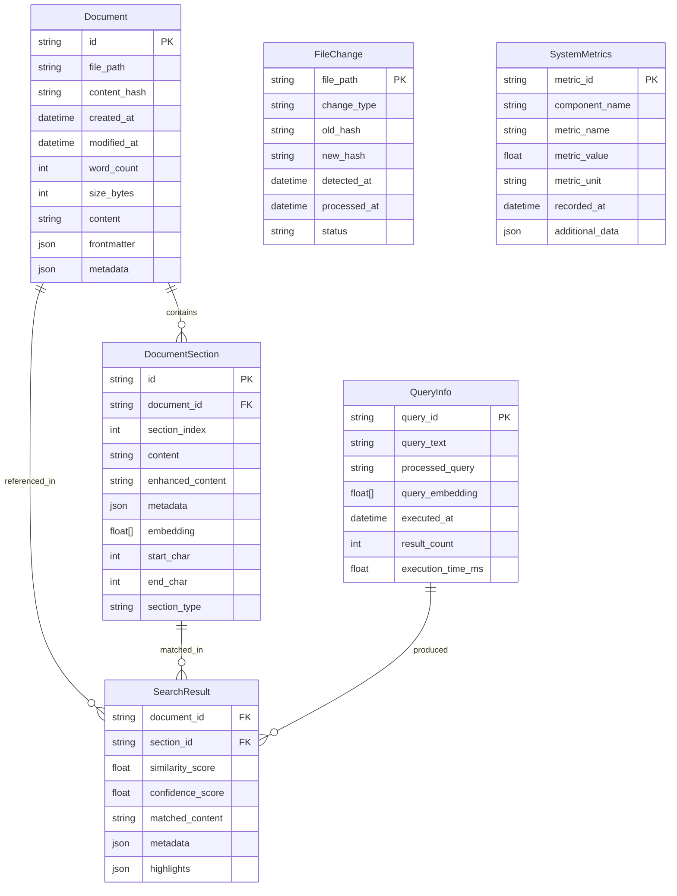

# Architecture Guide

This document provides an overview of the Markdown RAG MCP system architecture, component relationships, data flows, and system interactions.

## 🏗️ System Overview

The architecture is organized into five distinct layers:

- **Input Layer**: Handles raw markdown files and YAML frontmatter extraction
- **Processing Pipeline**: Transforms documents through parsing, chunking, enhancement, and embedding
- **Storage Layer**: Manages vector embeddings and change tracking in Milvus database
- **Search Layer**: Provides semantic search capabilities with query processing and ranking
- **Interface Layer**: Exposes functionality through CLI, Python library, and MCP server interfaces

## 📊 Component Architecture

### 1. Core Components

The [`RAGEngine`](src/markdown_rag_mcp/core/rag_engine.py) class orchestrates all system operations.

- **Component Initialization**: Starts up all required services in the correct order
- **Operation Coordination**: Routes indexing and search requests to appropriate components
- **Resource Management**: Handles connection pooling, memory usage, and cleanup
- **Error Orchestration**: Coordinates error handling across all components
- **Status Monitoring**: Provides system health and performance metrics

#### Document Indexing Pipeline

The indexing pipeline transforms markdown documents into searchable vector embeddings through a multi-stage process:

1. **Document Indexer**: Coordinates the entire indexing workflow
2. **Incremental Indexer**: Optimizes performance by only processing changed files
3. **Change Detection**: Tracks file modifications using content hashes and timestamps

**Processing Flow:**

- Files are scanned for changes using hash comparison
- Changed files are parsed to extract content and frontmatter metadata
- Documents are chunked into semantically meaningful sections
- Metadata enhancement enriches chunks with contextual information
- Embeddings are generated using HuggingFace transformer models
- Results are stored in Milvus vector database with metadata indexing

#### Query Processing System

The search system provides semantic search capabilities that go beyond simple keyword matching:

1. **Query Preprocessing**: Cleans and normalizes user queries
2. **Embedding Generation**: Converts queries to vector representations
3. **Similarity Search**: Performs vector similarity search in Milvus
4. **Result Ranking**: Applies confidence thresholds and metadata boosting
5. **Response Formatting**: Structures results with highlights and context

### 2. Document Processing Pipeline

The document processing pipeline transforms raw markdown files into semantically enriched, searchable content.

#### Markdown Parser

The [`MarkdownParser`](src/markdown_rag_mcp/parsers/markdown_parser.py) is responsible for extracting and structuring content from markdown files.

- **File Validation**: Ensures files are readable and within size limits
- **Content Parsing**: Extracts plain text while preserving structural elements
- **Hash Calculation**: Generates content hashes for change detection
- **Metadata Extraction**: Coordinates frontmatter parsing and enrichment

**Frontmatter Processing:**
The integrated [`FrontmatterParser`](src/markdown_rag_mcp/parsers/frontmatter_parser.py) handles YAML frontmatter extraction.

- Supports standard fields: title, tags, description, author, date
- Cleans and normalizes field values

#### Document Chunker

The [`DocumentChunker`](src/markdown_rag_mcp/indexing/chunker.py) intelligently segments documents into semantically coherent chunks.

**Chunking Strategy:**

1. **Header-Based Splitting**: Respects markdown heading hierarchy (#, ##, ###)
2. **Size Management**: Ensures chunks stay within embedding model limits
3. **Context Preservation**: Maintains section relationships and hierarchy
4. **Overlap Handling**: Provides configurable overlap between chunks for context

#### Metadata Enhancer

The [`MetadataEnhancer`](src/markdown_rag_mcp/indexing/metadata_enhancer.py) augments document chunks with contextual metadata to improve search quality.

**Enhancement Techniques:**

1. **Frontmatter Integration**: Blends YAML metadata into chunk content
2. **Field Weighting**: Applies configurable weights to different metadata fields
3. **Content Boosting**: Increases relevance of content with rich metadata
4. **Semantic Context**: Adds document-level context to individual chunks

### 3. Monitoring and Change Detection

The monitoring system provides real-time change detection of file system changes, enabling automatic index updates and maintaining data freshness without manual intervention.

#### File Watcher

The [`FileWatcher`](src/markdown_rag_mcp/monitoring/file_watcher.py) component provides low-level file system monitoring.

**Event Processing:**

1. **File System Events**: Captures create, modify, delete, and move operations
2. **Debounce Logic**: Waits for file operations to stabilize before processing
3. **Pattern Matching**: Applies inclusion/exclusion rules to filter relevant files
4. **Error Recovery**: Handles file system errors gracefully with automatic retry

#### Monitoring Coordinator

The [`MonitoringCoordinator`](src/markdown_rag_mcp/monitoring/monitoring_coordinator.py) manages the overall monitoring workflow.

**Operational Modes:**

- **Active Monitoring**: Real-time processing of file changes
- **Batch Mode**: Periodic scanning for environments with limited resources
- **Hybrid Mode**: Combines real-time events with periodic validation scans

#### Change Detector

The [`DocumentChangeDetector`](src/markdown_rag_mcp/indexing/change_detector.py) provides change detection.

**Change Detection Methods:**

1. **Content Hash Comparison**: Fast detection using SHA-256 file hashes
2. **Timestamp Analysis**: Secondary validation using file modification times
3. **Size Comparison**: Quick elimination of obviously unchanged files
4. **Deep Content Analysis**: Detailed comparison when heuristics are inconclusive

**Index Management:**
The system maintains a persistent index of file states:

- File path, content hash, size, and modification timestamps
- Processing status and error information
- Statistics on processing time and success rates
- Automatic cleanup of stale entries for deleted files

## 🔄 Data Flow Architecture

The data flow architecture illustrates how information moves through the system during key operations.

### 1. Document Indexing Flow

The document indexing process involves multiple components working in coordination to transform raw markdown files into searchable vector embeddings.

#### Processing Loop

For each file requiring indexing, the system executes a pipeline:

1. **Content Extraction**: The markdown parser extracts text content and YAML frontmatter
2. **Document Chunking**: Content is segmented into semantically coherent sections
3. **Metadata Enhancement**: Chunks are enriched with frontmatter and contextual information
4. **Embedding Generation**: HuggingFace models generate vector embeddings for each enhanced chunk
5. **Vector Storage**: Embeddings and metadata are stored in Milvus with appropriate indexing
6. **Change Tracking**: File hashes and processing timestamps are recorded for future change detection

### 2. Semantic Search Flow

The semantic search flow transforms user queries into meaningful results through vector similarity matching and intelligent ranking.

**Query Preparation:**
The search process begins with query preprocessing to optimize embedding quality:

- **Text Normalization**: Removes extraneous whitespace, standardizes encoding
- **Query Enhancement**: Expands abbreviations, corrects common typos
- **Context Addition**: Optionally adds search context based on user history

**Vector Similarity Search:**
The core search operation uses advanced vector mathematics:

1. **Query Embedding**: The preprocessed query is converted to a high-dimensional vector using the same model used for document indexing
2. **Vector Search**: Milvus performs efficient similarity search using cosine similarity or other configured distance metrics
3. **Initial Filtering**: Results are filtered based on minimum similarity thresholds
4. **Metadata Matching**: Additional filtering based on document metadata if specified

**Result Processing and Ranking:**
Raw similarity results are enhanced through intelligent ranking:

- **Confidence Scoring**: Converts similarity scores to confidence percentages
- **Metadata Boosting**: Increases scores for results with rich metadata or specific tags
- **Diversity Filtering**: Ensures result diversity by avoiding over-representation from single documents
- **Context Highlighting**: Identifies and formats relevant text passages for display

### 3. File System Monitoring Flow

The file system monitoring system ensures that the document index stays synchronized with the file system.

**Event Detection:**

- **File System Watchers**: Low-level OS integration captures file system events immediately
- **Event Filtering**: Only processes events for supported file types and paths
- **Debounce Processing**: Prevents processing of temporary or rapidly changing files

**Change Processing:**

1. **Event Validation**: Confirms that detected changes represent actual content modifications
2. **Priority Assignment**: Important files (frequently accessed, recently modified) receive higher processing priority
3. **Resource Management**: Limits concurrent processing to prevent system overload
4. **Error Recovery**: Implements retry logic for transient failures

#### Efficiency Optimizations

The monitoring system includes several performance optimizations:

**Event Debouncing:**

- Multiple rapid changes to the same file are consolidated into a single processing operation
- Configurable debounce windows (typically 2-5 seconds) balance responsiveness with efficiency
- Different debounce strategies for different file types and sizes

**Batching:**

- Related file changes (e.g., multiple files in the same directory) are processed together
- Batch processing reduces embedding model loading overhead
- Optimal batch sizes are determined based on available system resources

**False Positive Filtering:**
The system employs multiple techniques to avoid unnecessary processing:

- **Hash Comparison**: Quick elimination of files that haven't actually changed
- **Temporary File Detection**: Ignores editor temporary files and backup files
- **Size-Based Filtering**: Skips processing of very large or very small files
- **Extension Validation**: Only processes supported markdown file types

## 🔌 Data Models and Schemas

**Document Model:**
Represents the complete metadata and content information for a single markdown file:

- **Identity Fields**: Unique identifiers and file path references
- **Content Metadata**: Hash, size, word count, and timestamps for change tracking
- **Processing Status**: Tracks indexing status, error conditions, and processing statistics
- **Rich Metadata**: Stores extracted frontmatter and computed document properties

**DocumentSection Model:**
Represents individual chunks of documents created during the chunking process:

- **Hierarchy Information**: Section index, parent document, and structural relationships
- **Content Storage**: Original content, enhanced content with metadata integration
- **Vector Data**: High-dimensional embeddings and associated metadata
- **Positioning**: Character-level start/end positions within the source document

**Search and Query Models:**
**SearchResult**: Encapsulates search match information with confidence scoring and content highlighting
**QueryInfo**: Tracks query processing metadata, execution timing, and result statistics for analytics

**FileChange Model:**
Tracks file system modifications for incremental indexing:

- **Change Detection**: Captures change types (create, modify, delete, move)
- **Hash Comparison**: Stores old and new content hashes for validation
- **Processing Tracking**: Records processing status and error information
- **Temporal Data**: Timestamps for change detection and processing completion

**System Metrics Model:**
Provides comprehensive system monitoring and performance tracking:

- **Component Metrics**: Per-component performance and health statistics
- **Resource Usage**: Memory, CPU, and storage utilization measurements
- **Operation Timing**: Detailed timing information for all major operations
- **Error Analytics**: Error rates, types, and resolution statistics

### Data Relationships

The data model includes relationships:

- **Document-to-Section**: One-to-many relationship enabling efficient section retrieval
- **Query-to-Results**: Tracking relationship for search analytics and caching
- **File-to-Changes**: Historical change tracking for audit and rollback capabilities

